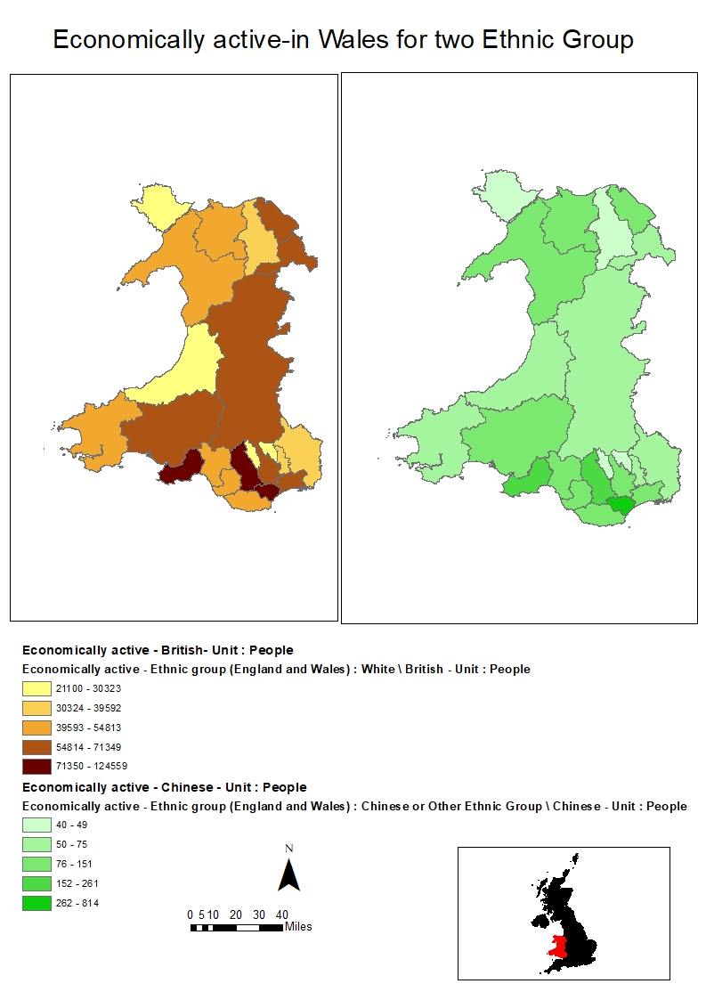

```{r}
library(maptools)
library(RColorBrewer)
library(classInt)
library(OpenStreetMap)
library(sp)
library(rgeos)
library(tmap)
library(tmaptools)
library(sf)
library(rgdal)
library(geojsonio)
library(dplyr)
library(methods)
walesdata<- read.csv("N:\\R\\walesdata\\walesdata.csv", header = TRUE, sep = ",")
walesmap<- read_shape("N:\\R\\Wales_ua_2001\\wales_ua_2001.shp", as.sf = TRUE)
walesmap2 <- walesmap %>% left_join(walesdata, by = c("label" = "GEO_CODE"))
tmap_mode("plot")

tm_shape(walesmap2)+
tm_polygons(c("Economically.active...Ethnic.group..England.and.Wales....White...British...Unit...People", "Economically.active...Ethnic.group..England.and.Wales....Chinese.or.Other.Ethnic.Group...Chinese...Unit...People"), 
            style=c("jenks", "pretty"),
            palette=list("YlOrBr", "Purples"),
            auto.palette.mapping=FALSE,
            title=c("Economically active of British", "Economically active of Chinese"))+
  tm_compass(position = c("left", "bottom"),type = "arrow") + 
  tm_scale_bar(position = c("left", "bottom")) +
  tm_layout(title = "Economically active in wales")


```

```{r}

```

This essay is aimed to access the pros and cons of GUI vs Command line generated maps and review the generation of two maps.

The shapefile used in Arcmap and R studio is generated from UK Data Service geography service(Welsh Unitary Authorities, 2001). The aggregate data about economic activity of British and Chinese comes from the InFuse 2001 census data. The UK data service provides not only boundary data but also attribute data, which is really easy to add the attribute data to the variables. The map I made compares the economic activity of British and Chinese in Wales.

In the Arcmap, I used two layers to make two maps which shown different attribute data and enable to compare the color ramp to analyze which group is more active in the area. The classification method is Natural Breaks which is most suitable in this case and the location of wales in UK is shown by using ‘selsect by location’ tool. Additionally, it’s convenient to insert the legend, title and north arrow in the layout view. 

In R studio, it takes only several lines to plot the map, however, it takes some time to learn the usage and argument. Additionally, there should be no typing error or format error in R studio. Firstly, I read the shapefile and data into the R, and then append the csv data into the map attribute data. Finally, I plot the map with many arguments in it.

From my perspective, both GUI(like Arcmap) and Command line generated maps(like R studio) have benefits and drawbacks. Firstly, the command line interface(CLI) is more difficult than graphical user interface(GUI) for the beginners. It takes me a little time to use tools to make the map in Arcmap, While I spend a lot of time learning the code and different methods by using ‘?’. Besides, any error could cause a failure. In conclusion, the command line interface seems like creating the map, while the GUI is using the tools to edit the shapefile. 

Secondly, the command line interface takes less system resource than GUI. The R generated map takes 88 kb, while the Arcmap generated map takes 279 kb. Thirdly, the CLI runs faster than GUI. In Arcmap, it’s really slow to present the map when zooming in or out especially a large shapefile in it.


Welsh Unitary Authorities, 2001 <https://census.edina.ac.uk/bookmark.html?userDirectory=AE7422A2F85AB416B5154154704379643%2F15415470443805315593531427931710&service=BOUNDARIES>

InFuse 2001 census data <http://infuse.ukdataservice.ac.uk/infusewiz.aspx?cookie=openaccess>


